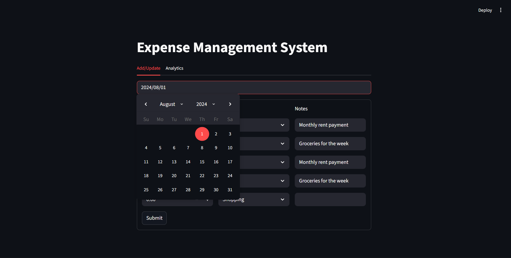
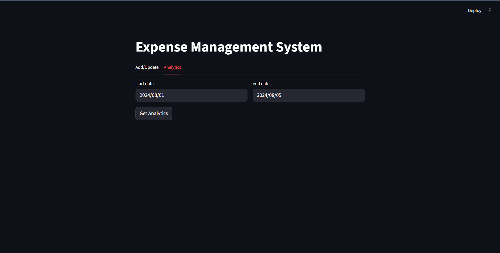

# 💰 Expense Management System


> **Stop wondering where your money went. Start telling it where to go.**

A robust, full-stack expense tracking application designed to help you monitor your daily spending habits. Built with a high-performance **FastAPI** backend and an interactive **Streamlit** frontend, this tool allows for seamless expense logging and visual data analysis.

---

## 📸 Application Preview

### 1. Expense Entry Dashboard
Easily add or update multiple expenses for any specific date. The system supports categorization and custom notes for better tracking.

(Screenshot 2025-12-04 204123.png)

### 2. Analytics & Visualizations
Gain insights into your spending habits with dynamic bar charts and detailed data tables. Filter data by date ranges to see exactly where your budget is going.

(Screenshot 2025-12-04 204211.png)(Screenshot 2025-12-04 204220.png)

---

## 🚀 Key Features

* **📝 Multi-Entry Forms:** Add multiple expense records (Amount, Category, Notes) for a single date in one go.
* **📊 Dynamic Analytics:** Visualize your spending breakdown by category (Rent, Food, Shopping, etc.) using interactive bar charts.
* **📅 Date Filtering:** Analyze expenses over specific time periods to track weekly or monthly trends.
* **💾 Persistent Storage:** All data is securely stored in a MySQL database.
* **⚡ Fast Performance:** Powered by FastAPI for rapid data retrieval and updates.

---

## 🛠️ Tech Stack

| Component | Technology | Description |
| :--- | :--- | :--- |
| **Frontend** | **Streamlit** | Interactive web interface for data entry and visualization. |
| **Backend** | **FastAPI** | High-performance REST API handling data requests. |
| **Database** | **MySQL** | Relational database for storing expense records. |
| **Data Logic** | **Pandas** | Used for data manipulation and generating analytics. |

---

## 🏁 Getting Started

Follow these steps to set up the project locally.

### 1. Prerequisites
Ensure you have the following installed:
* Python 3.x
* MySQL Server

### 2. Database Setup
The application requires a MySQL database to function. Run the following SQL commands in your MySQL workbench or terminal:

```sql
CREATE DATABASE expense_manager;

USE expense_manager;

CREATE TABLE expenses (
    expense_date DATE,
    amount DECIMAL(10,2),
    category VARCHAR(50),
    notes TEXT
);

## Project Structure
Expense-Tracking-System/
├── 📂 backend/          # FastAPI Server logic
│   ├── db_helper.py     # Database connection & queries
│   ├── server.py        # API Endpoints
│   └── logging_setup.py # Logger configuration
├── 📂 frontend/         # Streamlit UI
│   ├── app.py           # Main entry point
│   ├── add_update_ui.py # Expense entry tab
│   └── analytics_ui.py  # Visualization tab
├── 📂 tests/            # Unit tests
├── requirements.txt     # Python dependencies
└── README.md            # Project documentation

## Setup Instructions

1. **Clone the repository**:
   ```bash
   git clone https://github.com/yourusername/expense-management-system.git
   cd expense-management-system
   ```
1. **Install dependencies:**:   
   ```commandline
    pip install -r requirements.txt
   ```
1. **Run the FastAPI server:**:   
   ```commandline
    uvicorn server.server:app --reload
   ```
1. **Run the Streamlit app:**:   
   ```commandline
    streamlit run frontend/app.py
   ```
